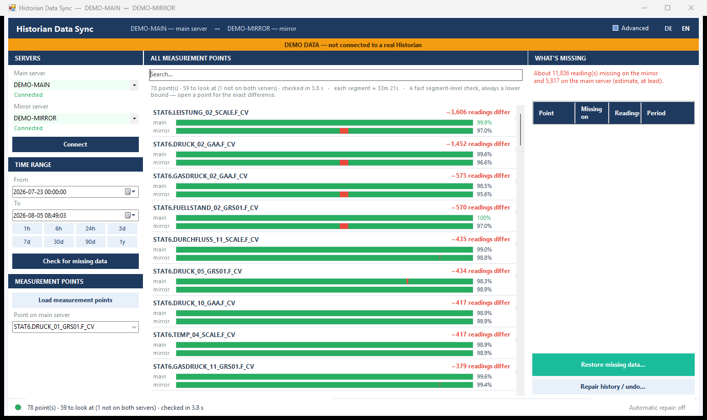

# Historian Data Sync — User Manual

**Version 2.1 · August 2026**

---

## Contents

1. [What this tool is for](#1-what-this-tool-is-for)
2. [Terms used in this manual](#2-terms-used-in-this-manual)
3. [Prerequisites](#3-prerequisites)
4. [Installation and first start](#4-installation-and-first-start)
5. [The screen, step by step](#5-the-screen-step-by-step)
   - 5.1 [Connecting to the two servers](#51-connecting-to-the-two-servers)
   - 5.2 [Choosing the time range](#52-choosing-the-time-range)
   - 5.3 [All measurement points](#53-all-measurement-points)
   - 5.4 [One measurement point](#54-one-measurement-point)
   - 5.5 [Restoring missing readings](#55-restoring-missing-readings)
   - 5.6 [Repair history and undo](#56-repair-history-and-undo)
   - 5.7 [Automatic repair](#57-automatic-repair)
   - 5.8 [The Advanced view](#58-the-advanced-view)
6. [Two ideas worth understanding](#6-two-ideas-worth-understanding)
7. [If something goes wrong](#7-if-something-goes-wrong)
8. [Appendix](#8-appendix)

---

## 1. What this tool is for

Two Historian servers record the same plant. They are meant to hold the same data, but they do
not always: a collector stops, a network link drops, a server is restarted for maintenance. When
that happens one server has readings the other never received.

This tool finds those differences and copies the missing readings from the server that has them
to the server that does not.

**What it does not do.** It never invents data, and it never creates measurement points. It only
copies readings that genuinely exist on one server into the other. If neither server recorded
something, nothing can bring it back.

> **The tool writes into a production Historian.** Everything it writes is recorded, and every
> repair can be undone — see [5.6](#56-repair-history-and-undo). Nothing is written until you
> confirm it.

---

## 2. Terms used in this manual

| Term | Meaning |
|---|---|
| **Measurement point** | One measured value in the plant — a temperature, a pressure, a flow. Historian calls these *tags*. |
| **Reading** | One recorded value of a measurement point, with the time it was recorded. Historian calls these *samples*. |
| **Main server** | The Historian you enter in the first field. Usually the primary plant server. |
| **Mirror server** | The second Historian, holding a redundant copy. |
| **Completeness** | How much of everything recorded for a point *this* server holds, as a percentage — measured against the other server. See [chapter 6](#6-two-ideas-worth-understanding). |
| **Time range** | The period you are looking at, set with **From** and **To**. Everything on screen refers to this period only. |
| **Restore** | Copying readings that one server is missing from the server that has them. |
| **Repair history** | The record of every restore this tool has performed, and the way to undo one. |
| **Automatic repair** | An unattended restore that runs on a schedule without anyone watching. |

---

## 3. Prerequisites

**On your PC**

- Windows 10 or Windows 11
- Microsoft .NET Framework 4.8 — already installed on all office machines
- No administrator rights, and no installation, are required

**Access to the plant**

- Network access to both Historian servers, on the ClientAccess port (normally **13000**)
- A Historian user account that may read from both servers, and **write to the server you
  intend to repair**

**You do not need** the Proficy Historian client installed. The one file the tool needs from it
is shipped alongside the program.

---

## 4. Installation and first start

1. Unpack the delivered ZIP file into any folder you can write to — for example
   `C:\Tools\HistorianSyncTool`. Do **not** put it in `C:\Program Files`: the tool keeps its
   repair record next to itself, and that folder is read-only for normal users.
2. Start `HistorianSyncTool.exe`.
3. Enter the two server addresses (see [5.1](#51-connecting-to-the-two-servers)) and click
   **Connect**.

After the first successful connection the addresses are remembered, and the tool connects to
them by itself the next time it starts.

**The folder contains**

| File | Purpose |
|---|---|
| `HistorianSyncTool.exe` | The program |
| `HistorianSyncTool.exe.config` | Settings, including the optional login (see [8](#8-appendix)) |
| `Proficy.Historian.ClientAccess.API.dll` | The GE component used to talk to Historian |
| `logs\` | Created on first use — see [8](#8-appendix) |

---

## 5. The screen, step by step

The window has three columns: settings on the left, the main area in the middle, and
**What's missing** on the right.



*The tool showing all measurement points. This example runs in demonstration mode — the amber
banner appears whenever the tool is not connected to a real Historian.*

### 5.1 Connecting to the two servers

Enter each server in the **Main server** and **Mirror server** fields. All of these work:

| You can type | Example |
|---|---|
| A computer name | `TESTSV1` |
| A name with a port | `TESTSV1:13000` |
| An IP address | `192.168.50.186` |
| An IP address with a port | `192.168.50.186:13000` |

Click **Connect**. Under each field the tool reports **Connected**, or the reason it could not
connect. Only addresses that actually connected are remembered for next time — a mistyped
address is never offered back to you.

**If the server asks for a login.** Most Historian servers reject an anonymous connection and
answer *"the server has rejected the client credentials"*. That is not a problem with the
address — the server was reached, it just would not let you in. Click **Login…**, enter the
Historian user name and password, and connect again. The same login is used for both servers.

Tick **Remember on this PC** to avoid retyping it. The password is then stored encrypted for
your Windows account only: it cannot be read by another user or on another computer, and it is
never part of the delivered program folder.

Leave both fields empty to connect as your Windows account instead — which is the right choice
when the tool runs on the Historian machine itself.

If the login is refused, the tool offers this dialog to you automatically.

### 5.2 Choosing the time range

**From** and **To** decide the period the tool examines. Everything else on screen refers to
that period and nothing outside it.

The buttons underneath jump to common periods: **1h, 6h, 24h, 3d, 7d, 30d, 90d, 1y**.

Changing the dates does **not** start a check by itself — you decide when to look, by clicking
**Check for missing data**. (Typing a date fires a change for every field you edit, which would
otherwise start a new check on every keystroke.)

> **The length of the range changes what can be seen.** A short range shows small gaps precisely;
> a long range covers more but cannot show a gap shorter than one segment of its own timeline.
> The line above the list always states how long one segment currently is.

### 5.3 All measurement points

Click **Check for missing data**. The tool examines every measurement point that both servers
have and lists them, **worst first**.

Each row shows the point's name, one bar per server, and, on the right, roughly how many readings
differ between the two servers.

| What you see | What it means |
|---|---|
| Green bar | This server has the readings |
| Red section | This server is missing readings that **the other server has** — these can be restored |
| Grey section | Neither server recorded anything here — nothing can be restored |
| "not set up on this server" | The point does not exist on that server at all. The tool copies readings; it does not create measurement points. |
| "could not be read" | The server did not answer for this point. This is **not** the same as "holds nothing" — see [7](#7-if-something-goes-wrong) |

The line above the list summarises the run: how many points were checked, how many need
attention, and how long one segment of the bars represents.

> The number on this screen is a **fast estimate and always a lower bound** — it is marked with
> `~`. Open a point for the exact figure. The estimate never decides what gets written.

Use the **Search** box to narrow the list to points whose name contains what you type.

### 5.4 One measurement point

Click a row to open that point. You now see, for this point and this time range:

- a **timeline** with both servers on one shared time axis, so the differences line up visually
- a **chart** of the measured values, main server above, mirror below
- the two **tables of readings**, one per server

Colours match the list: green means the server has the data, red means the other server has it
and this one does not, grey means neither has it.

**Enlarge** opens the chart in a larger window with its own time axis. **‹ All measurement
points** returns to the list.

The right-hand panel now shows the **exact** number of readings that would be copied in each
direction, calculated from the readings themselves rather than estimated.

### 5.5 Restoring missing readings

1. Click **Restore missing data…**
2. The tool compares both servers and shows, per measurement point, exactly how many readings it
   would copy and over what period. **Nothing has been written yet.**
3. Untick anything you do not want to touch.
4. Click **Start**.
5. A progress window shows the point being worked on. **Cancel** stops at the next safe point;
   you are then asked whether to keep what has already been copied or undo it immediately.
6. A report lists what was written per point, and can be exported as CSV or TXT.

**What the tool will not do**

- It never copies into a point a server does not have.
- It never copies the last couple of minutes: near "now" a collector may simply not have written
  yet, and that is not missing data.
- It reports a point as failed if the readings did not actually arrive. It does not report
  success it has not verified.

### 5.6 Repair history and undo

**Repair history / undo…** lists every restore this tool has performed: when, in which
direction, how many readings, and whether it has since been undone.

To undo one:

1. Select the run.
2. Tick **Enable undo** — the red button stays disabled until you do.
3. Click it and confirm.

Undo deletes **exactly** the readings that run wrote, matched by their individual timestamps.
Readings that were already on the server are never touched. If an undo is interrupted, the run
stays in the list so you can safely repeat it.

> The undo record is written into the `logs` folder next to the program. If the tool cannot
> write there, it tells you so and the restore cannot be undone later — this is why the program
> folder must be writable.

### 5.7 Automatic repair

Click **Automatic repair** in the status bar to configure an unattended restore.

| Setting | Meaning |
|---|---|
| Interval | How often it runs |
| Period | How far back each run looks, counting back from the moment it runs |
| Direction | Main → mirror, mirror → main, or both |
| Measurement points | All matching a filter, or an explicit list you tick |
| Run on startup | Also run once shortly after the program starts |

Automatic repairs write to the plant **without asking each time**. Because of that:

- the first time a startup run would happen, you must confirm it once, explicitly
- a run is skipped while you are doing something in the window
- every run is recorded in `logs\schedule-YYYY-MM.log`
- every run can still be undone from the repair history

### 5.8 The Advanced view

The **Advanced** switch in the title bar *adds* technical detail; it never removes anything.
It shows the activity log, per-direction copy buttons, the measurement-point filter, server
statistics, batch counters and the gap rule used per point.

Switching it off returns to the simple view. Nothing is lost — the same work is possible either
way.

---

## 6. Two ideas worth understanding

These two come up in every conversation about the numbers on screen.

### 6.1 What "complete" means here

A percentage is only meaningful against a yardstick. This tool can only ever make one server
match the other, so the yardstick is **the other server**:

> Completeness = of everything recorded for this point, in this period, by *either* server, how
> much does *this* server hold?

So 98.8 % means the server is missing about 1.2 % of everything that was recorded — and, since
the other server has it, that missing part can be restored. If **neither** server recorded
something, it counts against neither: that is a plant outage, not a synchronisation problem, and
it is drawn grey.

This is also why the bars are painted *in proportion*: the picture and the percentage are the
same quantity, so a bar cannot say one thing while the number says another.

### 6.2 Why it is not always 100 %, even after a repair

Three honest reasons:

1. **The gap exists on both servers.** Nothing to copy. Drawn grey.
2. **The point only exists on one server.** The tool copies readings; creating measurement points
   is a Historian configuration task.
3. **The two servers record independently.** Redundant collectors sample the same signal on their
   own clocks, so the same value is often stored a few seconds apart on each. Those are not
   missing readings, and copying them would mix two recordings together permanently rather than
   repair anything. The tool detects this and fills only genuine outages.

Point 3 is the reason two servers can each show slightly different figures and both be perfectly
healthy.

---

## 7. If something goes wrong

| What you see | What it means | What to do |
|---|---|---|
| **Could not connect** | Wrong address or port, or the server is unreachable | Check the address; try `host:13000`. Confirm from your PC that the port is reachable |
| **The user name cannot be empty** | The server rejects anonymous access | Enter a login in `HistorianSyncTool.exe.config` — see [8](#8-appendix) |
| **Could not load this server's readings** | The read failed. This is *not* "the server holds nothing" | Retry. The tool deliberately leaves that server out of the result rather than reporting it as empty |
| **not set up on this server** | The point does not exist there | Create the point in Historian first, if it belongs there |
| A point shows 0 % | That server recorded nothing for it in this period | This is a real, restorable difference and is listed first |
| **… could NOT be saved to the repair history** | The program folder is not writable | Move the folder somewhere you can write. Readings **were** written but that run cannot be undone |
| Nothing to restore, but the bars are not full | The missing part is grey (missing on both) or the servers record independently | See [chapter 6](#6-two-ideas-worth-understanding) |

---

## 8. Appendix

### Files the tool creates

| Path | Contents |
|---|---|
| `logs\schedule-YYYY-MM.log` | One line per automatic run |
| `logs\backfill-journal\*.json` | The record of exactly which readings each restore wrote — this is what makes undo possible. **Do not delete.** |

Personal settings — server addresses, language, time range, schedule — are stored per Windows
user, not in the program folder, and are carried over automatically when you update to a newer
version.

### Optional login

If the servers reject an empty user name, open `HistorianSyncTool.exe.config` in a text editor
and fill in:

```xml
<add key="HistorianUsername" value="your-user" />
<add key="HistorianPassword" value="your-password" />
```

Leave both empty to use your Windows session, which works when the tool runs on the Historian
machine itself.

### Other settings in the same file

| Key | Default | Meaning |
|---|---|---|
| `LiveEdgeGraceSeconds` | 120 | How much of the most recent period is left alone, because collectors may still be writing there |
| `BatchSizeMinutes` | 10 | How much data is written per step |
| `MinimumGapSeconds` | 120 | Silence shorter than this is never treated as a gap |
| `GapThresholdMultiplier` | 2.0 | How much longer than its normal rhythm a point must be silent before it counts as a gap |

### Demonstration mode

Starting the program with `--demo` runs it against a generated pair of servers. It contacts no
Historian at all and can change nothing. An amber banner makes this unmistakable. Use it to try
the tool out, or to show it, without a plant connection.

### Version

Historian Data Sync **2.1** · manual revision August 2026.
